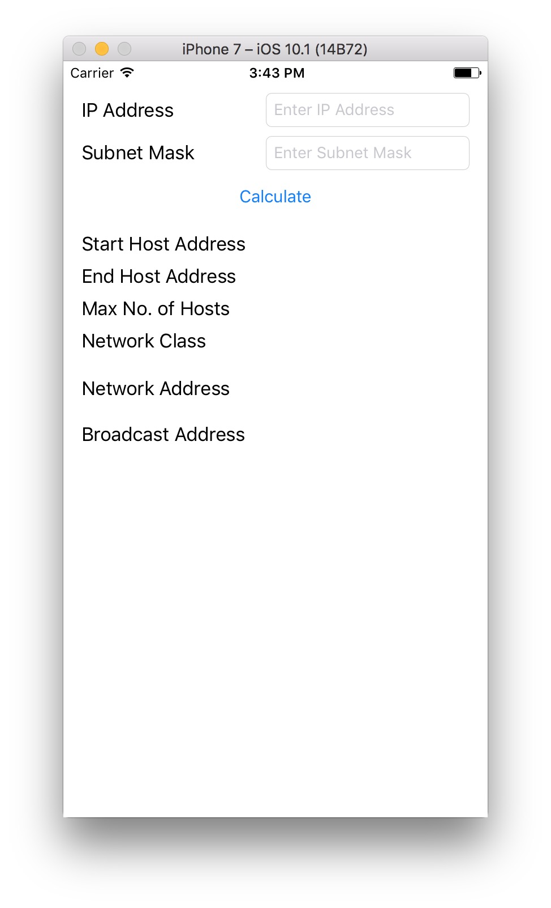
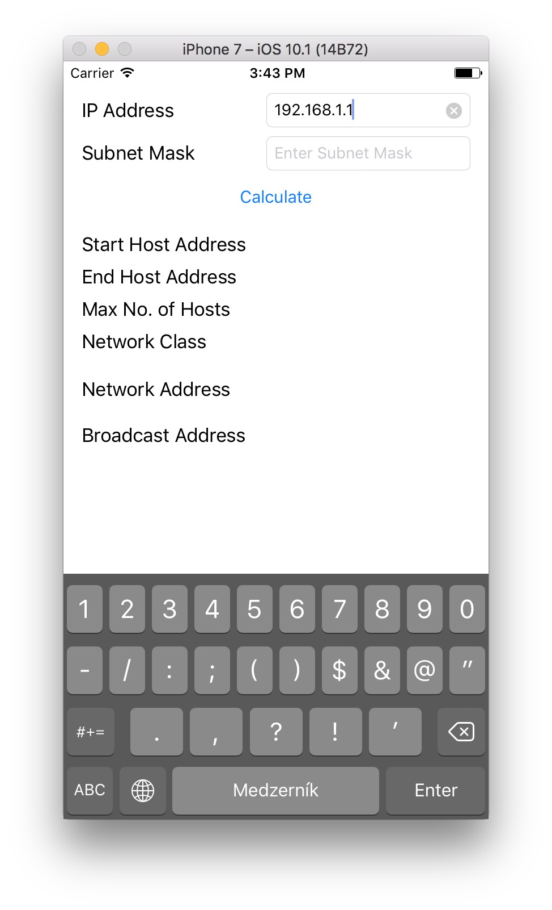
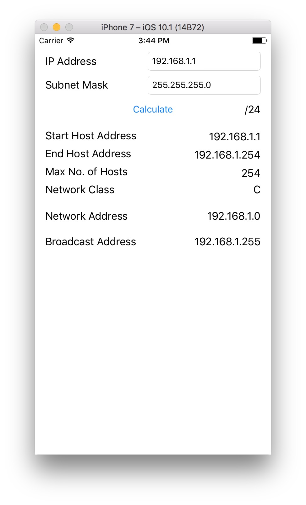

# IP Subnet Calculator
> IP Subnet Calculator for iOS, built in Swift

## Description

This is my first project which is inspired by some school stuff. It's just a simple IP Subnet Calculator.

## Screenshots

